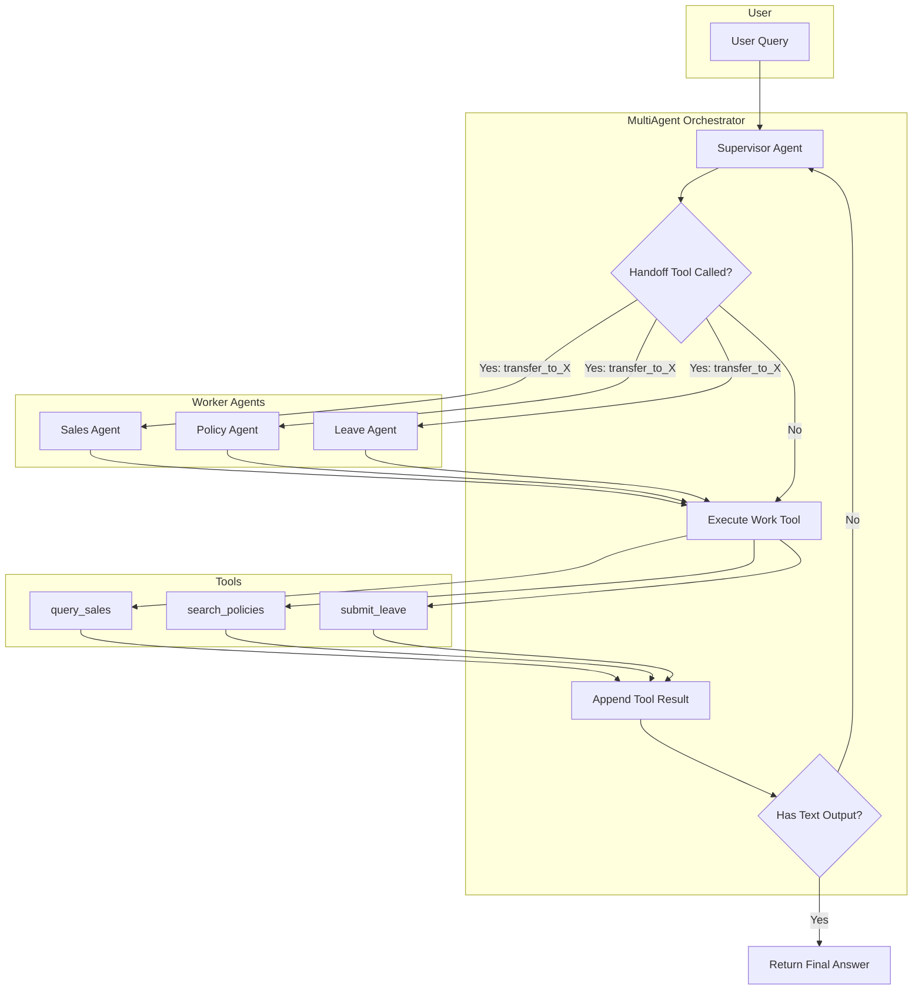

# The Model-as-Agent Era: Multi-Agent in ~300 Lines (No Framework)

*Modern AI models can now orchestrate multi-agent systems natively. No LangChain, no CrewAI, no AutoGen needed.*

> 📖 **Read this article for free:** [github.com/minddev25/model_as_agents](https://github.com/minddev25/model_as_agents)

---

# Part 1: The Age of "Model Is The Agent"

Remember when building an AI agent meant stitching together a dozen libraries? You'd wire up LangChain for orchestration, add a vector store, configure memory modules, and pray everything worked together.

**Modern AI models are changing that.**

As models evolve with native tool-calling, persistent context, and built-in reasoning, the model *itself* becomes the agent. The trend is clear: frameworks are becoming optional. The model handles orchestration, tool execution, and state management natively.

## Why Does This Matter?

Traditional agent frameworks do three things:

1. **Orchestration** — deciding what to do next
2. **Tool execution** — calling external systems
3. **Memory management** — tracking conversation state

Modern AI models handle all three natively:

| What You Needed Before | What Modern Models Do |
|------------------------|----------------------|
| LangChain chains | Native tool-calling loop |
| Custom routing logic | Model decides via function calls |
| Memory modules | Conversation state in context |
| ReAct prompting tricks | Built-in reasoning |

The result? Your "framework" becomes a simple while-loop that feeds tool results back to the model.

---

# Part 2: Building a Multi-Agent System from Scratch

In this section, I'll show you how to build a fully functional **multi-agent enterprise assistant** with:

- A **Supervisor** that routes requests intelligently
- A **Sales Agent** that queries databases
- A **Policy Agent** that searches company documents
- A **Leave Agent** that submits HR requests

All using **one model**, **one API**, and **zero agent frameworks**. 

The example uses GPT-5.2's Responses API, but the pattern applies to any model with robust tool-calling (Claude, Gemini, DeepSeek-V3.2, etc.).

## Architecture

```
┌─────────────────────────────────────────────────────────────┐
│                      MultiAgent                             │
│  ┌───────────────────────────────────────────────────────┐  │
│  │                   Supervisor                          │  │
│  │  tools: [transfer_to_sales, transfer_to_policy, ...]  │  │
│  └───────────────────────────────────────────────────────┘  │
│          │                    │                    │        │
│          ▼                    ▼                    ▼        │
│  ┌─────────────┐    ┌─────────────┐    ┌─────────────┐     │
│  │ SalesAgent  │    │ PolicyAgent │    │ LeaveAgent  │     │
│  │ [query_db]  │    │ [search]    │    │ [submit]    │     │
│  └─────────────┘    └─────────────┘    └─────────────┘     │
└─────────────────────────────────────────────────────────────┘
```

## How It Works: The Complete Flow



### The Secret Sauce: Handoff as Tool

Here's the key insight that makes multi-agent architectures trivial:

> **Define each worker agent as a "transfer" tool. Let the model decide when to hand off.**

You simply declare which agents can hand off to which:

```python
agents = {
    "supervisor": Agent(
        instructions="Route requests to specialists.",
        handoffs=["sales", "policy", "leave"]  # ← That's it!
    ),
    "sales": Agent(
        instructions="Answer sales questions.",
        tools=[query_sales]
    ),
}
```

The `MultiAgent` orchestrator automatically generates `transfer_to_sales`, `transfer_to_policy`, etc. as tools. The Supervisor sees these tools and calls them based on *understanding*, not keyword matching.

This is the same pattern OpenAI's official [Agents SDK](https://github.com/openai/openai-agents-python) uses internally. But you don't need the SDK—we'll build it in ~200 lines.

---

## Implementation: The Core Components

### 1. The `@tool` Decorator

Turn any Python function into an OpenAI-compatible tool with auto-generated schema:

```python
import inspect
from typing import get_type_hints

TYPE_MAP = {str: "string", int: "integer", float: "number", bool: "boolean"}

def tool(description: str):
    """Decorator that auto-generates OpenAI tool schema from function signature."""
    def decorator(fn):
        hints = get_type_hints(fn)
        params = inspect.signature(fn).parameters
        
        properties = {}
        required = []
        for name, param in params.items():
            ptype = hints.get(name, str)
            properties[name] = {"type": TYPE_MAP.get(ptype, "string")}
            if param.default is inspect.Parameter.empty:
                required.append(name)
        
        fn._tool_schema = {
            "type": "function",
            "name": fn.__name__,
            "description": description,
            "parameters": {
                "type": "object",
                "properties": properties,
                "required": required,
            },
        }
        return fn
    return decorator
```

Now defining tools is dead simple:

```python
@tool("Query sales database")
def query_sales(query: str) -> dict:
    return {"rows": [...]}

@tool("Search company policies")
def search_policies(query: str) -> dict:
    return {"policies": [...]}
```

### 2. The Agent Class

An agent is just instructions + tools + handoffs. 4 lines:

```python
from dataclasses import dataclass, field
from typing import Callable

@dataclass
class Agent:
    instructions: str
    tools: list[Callable] = field(default_factory=list)
    handoffs: list[str] = field(default_factory=list)
```

### 3. The MultiAgent Orchestrator

This is the core—a class that:
1. Auto-generates handoff tools from `agent.handoffs`
2. Runs the conversation loop
3. Switches agents when a handoff tool is called

```python
class MultiAgent:
    def __init__(self, agents: dict[str, Agent], supervisor: str = "supervisor"):
        self.agents = agents
        self.supervisor = supervisor
        self.client = OpenAI()
        
        # Build tool registry and handoff map
        self._tool_registry = {}
        self._handoff_map = {}
        self._agent_tools = {}
        
        for key, agent in agents.items():
            tools_for_agent = []
            
            # Register work tools
            for t in agent.tools:
                self._tool_registry[t.__name__] = t
                tools_for_agent.append(t._tool_schema)
            
            # Auto-generate handoff tools
            for target in agent.handoffs:
                tool_name = f"transfer_to_{target}"
                handoff_schema = {
                    "type": "function",
                    "name": tool_name,
                    "description": f"Transfer to {target} agent.",
                    "parameters": {
                        "type": "object",
                        "properties": {"reason": {"type": "string"}},
                        "required": ["reason"],
                    },
                }
                tools_for_agent.append(handoff_schema)
                self._handoff_map[tool_name] = target
            
            self._agent_tools[key] = tools_for_agent
    
    def run(self, query: str, max_turns: int = 10) -> str:
        input_items = [{"role": "user", "content": query}]
        current = self.supervisor
        
        for _ in range(max_turns):
            agent = self.agents[current]
            tools = self._agent_tools[current]
            
            resp = self.client.responses.create(
                model="gpt-5.2",
                instructions=agent.instructions,
                input=input_items,
                tools=tools or None,
            )
            
            input_items += resp.output
            calls = [o for o in resp.output if o.type == "function_call"]
            
            if not calls:
                return resp.output_text  # Final answer
            
            for call in calls:
                name = call.name
                args = json.loads(call.arguments)
                
                if name in self._handoff_map:
                    # Handoff to another agent
                    current = self._handoff_map[name]
                    input_items.append({
                        "type": "function_call_output",
                        "call_id": call.call_id,
                        "output": '{"ok": true}'
                    })
                    break
                else:
                    # Execute work tool
                    result = self._tool_registry[name](**args)
                    input_items.append({
                        "type": "function_call_output",
                        "call_id": call.call_id,
                        "output": json.dumps(result)
                    })
        
        return "(max turns)"
```

~80 lines. That's your entire multi-agent framework.

### 4. Define Your Agents

Now the fun part—just declare your agents, I used some mocked data and return to simply the demo demonstration:

```python
@tool("Query sales database")
def query_sales(query: str) -> dict:
    return {"rows": [{"month": "2025-12", "region": "North", "revenue": 140000}]}

@tool("Search company policies")
def search_policies(query: str) -> dict:
    return {"policies": [{"title": "Expenses", "text": "Under $500: manager approval"}]}

@tool("Submit leave request")
def submit_leave(start_date: str, end_date: str, reason: str) -> dict:
    return {"request_id": "LR-1001", "status": "pending"}

agents = {
    "supervisor": Agent(
        instructions="Route requests. Transfer to: sales, policy, or leave.",
        handoffs=["sales", "policy", "leave"],
    ),
    "sales": Agent(
        instructions="Answer sales questions using query_sales.",
        tools=[query_sales],
    ),
    "policy": Agent(
        instructions="Answer policy questions using search_policies.",
        tools=[search_policies],
    ),
    "leave": Agent(
        instructions="Handle leave requests using submit_leave.",
        tools=[submit_leave],
    ),
}

app = MultiAgent(agents)
result = app.run("What is our expense policy?")
```

---

## See It In Action

**Query 1: Policy Question**
```
============================================================
User: What is our expense policy?
============================================================

  [supervisor] thinking...
  [supervisor] tool: transfer_to_policy({'reason': 'User asks about expense policy'})
  [supervisor] → handoff to [policy]

  [policy] thinking...
  [policy] tool: search_policies({'query': 'expense policy'})
  [policy] → final answer

────────────────────────────────────────────────────────────
Answer:
Our Expense Policy (P003):
- Under $500: manager approval
- Over $500: finance approval
```

**Query 2: Sales Data**
```
============================================================
User: Show me North region sales
============================================================

  [supervisor] thinking...
  [supervisor] tool: transfer_to_sales({'reason': 'User requests sales data'})
  [supervisor] → handoff to [sales]

  [sales] thinking...
  [sales] tool: query_sales({'query': 'North region'})
  [sales] → final answer

────────────────────────────────────────────────────────────
Answer:
North region sales (2025):
- Oct: $120,000
- Nov: $135,000  
- Dec: $140,000
Total: $395,000 (+12.5% growth)
```

**Query 3: Leave Request**
```
============================================================
User: I want to take leave Dec 23-27
============================================================

  [supervisor] thinking...
  [supervisor] tool: transfer_to_leave({'reason': 'User requests time off'})
  [supervisor] → handoff to [leave]

  [leave] thinking...
  [leave] tool: submit_leave({'start_date': '2025-12-23', 'end_date': '2025-12-27', ...})
  [leave] → final answer

────────────────────────────────────────────────────────────
Answer:
Leave request submitted!
- Request ID: LR-1001
- Dates: Dec 23-27, 2025
- Status: Pending approval
```

The model routes correctly every time—not because of keyword matching, but because it *understands* the request.

---

# Part 3: Insights & Conclusion

## Why This Matters

### 1. Dramatically Simpler Code

| Approach | Lines of Code |
|----------|---------------|
| Typical LangChain setup | 500-1000+ |
| Our MultiAgent | ~200 (reusable) |
| Your business logic | ~100 |

### 2. Easier to Debug

When something goes wrong, you look at one file. The conversation history is a simple list. Tool calls are just function calls. No hidden state machines.

### 3. Smarter Routing

The model understands nuance:
- "I need to take some time off next week" → Leave Agent ✓
- "What are the rules about working from home?" → Policy Agent ✓
- "How did we do last quarter?" → Sales Agent ✓

No keyword matching. No intent classification model. Just the model understanding language.

### 4. Future-Proof

As models improve, your agent improves automatically. No framework version conflicts. No migration headaches.

---

## When Do You Still Need a Framework?

To be fair, frameworks still have their place:

- **Complex memory** — if you need long-term memory across sessions
- **Pre-built integrations** — if you need 50 ready-made tool adapters
- **Visual debugging** — if you want LangSmith-style tracing
- **Team collaboration** — if you need declarative YAML configs

But for most use cases? Native tool-calling is enough.

---

## Conclusion

Modern AI models represent a paradigm shift. The model isn't just a component in your agent—**the model IS the agent**.

Stop fighting framework abstractions. Stop debugging chain dependencies. Start building with the simplest thing that works:

1. **`@tool` decorator** — turn functions into tools
2. **`Agent` dataclass** — define instructions + capabilities  
3. **`MultiAgent` class** — orchestrate everything

~300 lines total. Zero dependencies beyond `openai`.

**The future of AI agents is frameworkless. And it's available today.**

---

📦 **Full source code:** [github.com/minddev25/model_as_agents](https://github.com/minddev25/model_as_agents)

👉 **[Getting Started Guide](./Getting_Started.md)**

---

